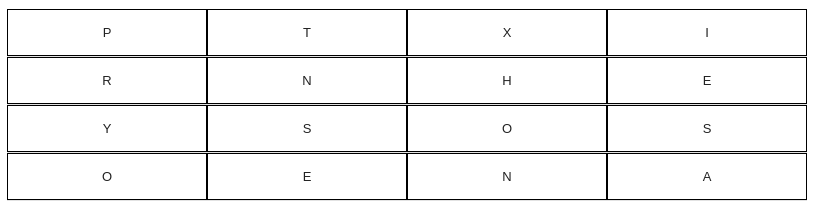
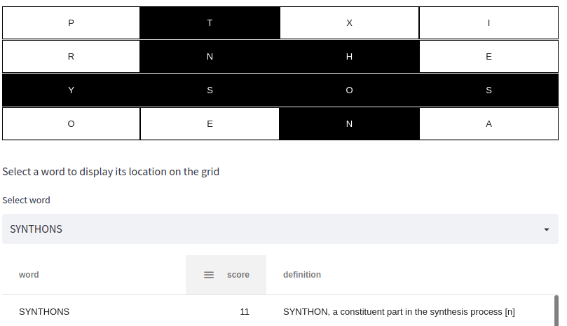

# Boggle solving algorithm
This is a project that I built to try out streamlit on some existing code that I had for another project.  
Deployed as part of the Daisi platform hackathon: https://www.hackerearth.com/challenges/hackathon/the-very-first-daisitm-hackathon/ 

It is an interactive streamlit app that will solve a 4X4 english boggle grid.

## Boggle

Boggle is a game where a set of dice with letters on are thrown into a grid.  Players then have to build words out of letters that touch, in order, without visiting the same letter twice.  For example:

A player might put down 'hone', taking the H from the 3rd column, and following it down to the N, then going to the E.  Each following letter in the word must touch the proceeding letter, and a letter that has already been selected can't be used twice.

A great player might choose the following:

Longer words get more points.  I've capped the word list to only include words 4 letters or more to keep it interesting.  

## How the solver works:

Why is this an interesting algorithm?  Well, the game is actually a really cool application of a data structure from computer science called a trie.

Imagine trying to solve the wall by brute force.  You start at the top left, then going letter to letter moving depth first to longer and longer sequences.  

On this 4x4 board, that leads to 12,029,640 sequences (where they reange in length form 1 to 16 characters).  You would then have to compare this to the dictionary (my one that I have attached restricts it to words that are at least 4 letters long contains 220,701 words).

It would be much more efficient if the search was able to give up when the sequence that it's building is guaranteed to not produce any words.

Instead of comparing each sequence to how many words contain that sequence in the dictionary, we can instead build a trie.

A trie is a data structure that can be used to store strings, and can be visualised as a graph, with nodes and edges.  Each node has up to 26 children, one for each letter of the alphabet.  These are connected by edges, which connect each node to its child.

We start by feeding our dictionary into this tree structure, a character at a time, counting the time a letter was used as a child of the previous character.  We then do this with each word, until we reach the end of the dictionary.

For example, to take a very small dictionary:

| Word      | Definition |
| ----------- | ----------- |
| CAT      | A small mammal  (n)      |
| CATTY   | Rude or abrasive in behaviour (adj)        |
| CATEGORICALLY   | In a way that is unambiguous, explicit and direct. (adverb) |

We build our tree by first sending:

C(1)>A(1)>T(1)

We then add:

C(2)>A(2)>T(2)>T(1)>Y(1)

And to add the last, we need to add another node:
            >T(1)>T(1)>Y(1)
C(3)>A(3)>T(4)
              E>(1)>G(1)>O(1)>R(1)>I(1)>C(1)>A(1)>L(1)>L(1)>Y(1) 

So, as we are building our paths in the boggle grid to find words, we are able to stop early, without comparing each prefix to every word in the dictionary, counting the number that match.  This is much more efficient, as it means that the entire dictionary only gets indexed once upon building the trie.

Whilst the entire trie has to be stored in memory, it means that lookups are very quick - the trie will highlight whether there is any point in continuing a sequence under examination, meaning that the algorithm's time complexity for space, search, insert and delete operations can be performed in O(n) time.

## Where do tries shine?

Tries are great when there is a set of dictionary words that need to be searched in order to find a good match.

You may have come across them when you use predictive text, fuzzy string matching and spell checking.

A specialised, compressed version of a trie is used by web search engines to enable users to search the entire internet!
